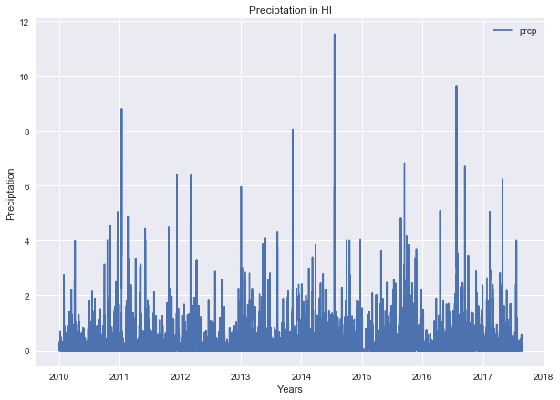
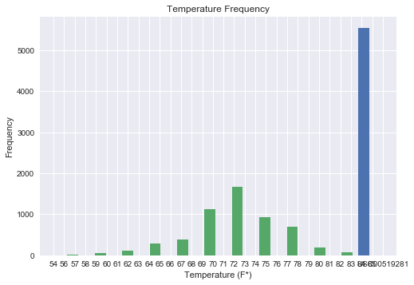

```python
#IMPORTS
import pandas as pd
import numpy as np
import matplotlib as plt
#matplotlib.use('nbagg')
from matplotlib import style
import seaborn
style.use('seaborn')
import matplotlib.pyplot as plt
import csv
import sqlalchemy
from sqlalchemy import create_engine, Column, Integer, String, Date, Float
from sqlalchemy.ext.declarative import declarative_base
from sqlalchemy.ext.automap import automap_base
from sqlalchemy.orm import Session
from datetime import datetime

```


```python
#CREATE ENGINE
engine = create_engine("sqlite:///hawaii.sqlite")
```


```python
# Declare a Base using `automap_base()`
Base = automap_base()
 # Use the Base class to reflect the database tables
Base.prepare(engine, reflect=True)
 # Print all of the classes mapped to the Base
Base.classes.keys()
```


    ['measurements', 'stations']


```python
#ASSIGN CLASSES to VARIABLES 
Measurements = Base.classes.measurements
Stations = Base.classes.stations
```

# PRECIPTATION ANALYSIS


```python
# Create a session
session = Session(engine)
```


```python
# Display the row's columns and data in dictionary format
prcp = session.query(Measurements).first()
prcp.__dict__
```


    {'_sa_instance_state': <sqlalchemy.orm.state.InstanceState at 0x1a0a4ac278>,
     'date': datetime.date(2010, 1, 1),
     'm_id': 1,
     'prcp': 0.08,
     'station': 'USC00519397',
     'tobs': 65}


```python
#CREATE QUERY
precp= session.query(Measurements.date, Measurements.prcp)
```


```python
#READ QUERY INTO PANDAS AND THEN USE MATPLOT
#https://stackoverflow.com/questions/45523908/how-to-store-results-from-sql-query-and-use-it
#https://stackoverflow.com/questions/12047193/how-to-convert-sql-query-result-to-pandas-data-structure

precp_dates = pd.read_sql_query(precp.statement, engine, index_col = 'date')

```


```python
precp_dates.plot(figsize = (10,7))
plt.xlabel('Years')
plt.ylabel('Preciptation')
plt.title('Preciptation in HI')
plt.title()
```


    ---------------------------------------------------------------------------

    TypeError                                 Traceback (most recent call last)

    <ipython-input-27-bf863fe62a2d> in <module>()
          3 plt.ylabel('Preciptation')
          4 plt.title('Preciptation in HI')
    ----> 5 plt.title()
    

    TypeError: title() missing 1 required positional argument: 's'





# STATION & TEMP


```python
# Display the row's columns and data in dictionary format
station = session.query(Stations).first()
station.__dict__
```


    {'_sa_instance_state': <sqlalchemy.orm.state.InstanceState at 0x1a0a47f160>,
     'elevation': 3.0,
     'latitude': 21.2716,
     'longitude': -157.8168,
     'name': 'WAIKIKI 717.2, HI US',
     's_id': 1,
     'station': 'USC00519397'}


```python
#csv - 9 stations
#COUNTING QUERY: https://stackoverflow.com/questions/14754994/why-is-sqlalchemy-count-much-slower-than-the-raw-query
from sqlalchemy import func
```


```python
count_stations = session.query(Stations.station).group_by(Stations.station).count()
```


```python
count_stations
```


    9


```python
#Design a query to find the most active stations.
#List the stations and observation counts in descending order
#Which station has the highest number of observations?
station_activity = session.query(Stations.station, Stations.name, Measurements.station, func.count(Measurements.tobs)).filter(Stations.station == Measurements.station).group_by(Measurements.station).order_by(func.count(Measurements.tobs).desc()).all()

```


```python
station_activity
```


    [('USC00519281', 'WAIHEE 837.5, HI US', 'USC00519281', 11088),
     ('USC00519397', 'WAIKIKI 717.2, HI US', 'USC00519397', 10896),
     ('USC00513117', 'KANEOHE 838.1, HI US', 'USC00513117', 10836),
     ('USC00519523', 'WAIMANALO EXPERIMENTAL FARM, HI US', 'USC00519523', 10676),
     ('USC00516128', 'MANOA LYON ARBO 785.2, HI US', 'USC00516128', 10448),
     ('USC00514830',
      'KUALOA RANCH HEADQUARTERS 886.9, HI US',
      'USC00514830',
      8808),
     ('USC00511918', 'HONOLULU OBSERVATORY 702.2, HI US', 'USC00511918', 7916),
     ('USC00517948', 'PEARL CITY, HI US', 'USC00517948', 5488),
     ('USC00518838', 'UPPER WAHIAWA 874.3, HI US', 'USC00518838', 2044)]


##MOST ACTIVE: 'USC00519281', 'WAIHEE 837.5, HI US'


```python
mactivity=(('USC00519281', 'WAIHEE 837.5, HI US'))
```


```python
#Design a query to retrieve the last 12 months of temperature observation data (tobs).
#Filter by the station with the highest number of observations.
#Plot the results as a histogram with bins=12.

temp=session.query(Measurements.station, Measurements.tobs).filter(Measurements.station == mactivity[0]).all()
```


```python
temp
```


    [('USC00519281', 70),
     ('USC00519281', 62),
     ('USC00519281', 74),
     ('USC00519281', 75),
     ('USC00519281', 74),
     ('USC00519281', 76),
     ('USC00519281', 69),
     ('USC00519281', 66),
     ('USC00519281', 70),
     ('USC00519281', 75),
     ('USC00519281', 64),
     ('USC00519281', 60),
     ('USC00519281', 61),
     ('USC00519281', 68),
     ('USC00519281', 64),
     ('USC00519281', 66),
     ('USC00519281', 67),
     ('USC00519281', 70),
     ('USC00519281', 67),
     ('USC00519281', 67),
     ('USC00519281', 69),
     ('USC00519281', 60),
     ('USC00519281', 75),
     ('USC00519281', 75),
     ('USC00519281', 65),
     ('USC00519281', 75),
     ('USC00519281', 69),
     ('USC00519281', 67),
     ('USC00519281', 66),
     ('USC00519281', 69),
     ('USC00519281', 72),
     ('USC00519281', 67),
     ('USC00519281', 65),
     ('USC00519281', 64),
     ('USC00519281', 67),
     ('USC00519281', 67),
     ('USC00519281', 68),
     ('USC00519281', 69),
     ('USC00519281', 66),
     ('USC00519281', 69),
     ('USC00519281', 61),
     ('USC00519281', 71),
     ('USC00519281', 70),
     ('USC00519281', 70),
     ('USC00519281', 66),
     ('USC00519281', 71),
     ('USC00519281', 61),
     ('USC00519281', 68),
     ('USC00519281', 67),
     ('USC00519281', 62),
     ('USC00519281', 65),
     ('USC00519281', 69),
     ('USC00519281', 63),
     ('USC00519281', 62),
     ('USC00519281', 61),
     ('USC00519281', 64),
     ('USC00519281', 72),
     ('USC00519281', 68),
     ('USC00519281', 68),
     ('USC00519281', 68),
     ('USC00519281', 71),
     ('USC00519281', 69),
     ('USC00519281', 65),
     ('USC00519281', 67),
     ('USC00519281', 71),
     ('USC00519281', 70),
     ('USC00519281', 69),
     ('USC00519281', 69),
     ('USC00519281', 70),
     ('USC00519281', 69),
     ('USC00519281', 70),
     ('USC00519281', 73),
     ('USC00519281', 74),
     ('USC00519281', 67),
     ('USC00519281', 68),
     ('USC00519281', 64),
     ('USC00519281', 65),
     ('USC00519281', 68),
     ('USC00519281', 68),
     ('USC00519281', 72),
     ('USC00519281', 67),
     ('USC00519281', 64),
     ('USC00519281', 71),
     ('USC00519281', 70),
     ('USC00519281', 72),
     ('USC00519281', 73),
     ('USC00519281', 74),
     ('USC00519281', 69),
     ('USC00519281', 71),
     ('USC00519281', 72),
     ('USC00519281', 71),
     ('USC00519281', 74),
     ('USC00519281', 73),
     ('USC00519281', 71),
     ('USC00519281', 71),
     ('USC00519281', 69),
     ('USC00519281', 69),
     ('USC00519281', 72),
     ('USC00519281', 68),
     ('USC00519281', 75),
     ('USC00519281', 69),
     ('USC00519281', 65),
     ('USC00519281', 68),
     ('USC00519281', 65),
     ('USC00519281', 66),
     ('USC00519281', 64),
     ('USC00519281', 69),
     ('USC00519281', 69),
     ('USC00519281', 70),
     ('USC00519281', 69),
     ('USC00519281', 69),
     ('USC00519281', 69),
     ('USC00519281', 70),
     ('USC00519281', 77),
     ('USC00519281', 77),
     ('USC00519281', 71),
     ('USC00519281', 71),
     ('USC00519281', 70),
     ('USC00519281', 70),
     ('USC00519281', 72),
     ('USC00519281', 73),
     ('USC00519281', 71),
     ('USC00519281', 70),
     ('USC00519281', 72),
     ('USC00519281', 73),
     ('USC00519281', 72),
     ('USC00519281', 68),
     ('USC00519281', 76),
     ('USC00519281', 77),
     ('USC00519281', 73),
     ('USC00519281', 69),
     ('USC00519281', 71),
     ('USC00519281', 73),
     ('USC00519281', 73),
     ('USC00519281', 77),
     ('USC00519281', 73),
     ('USC00519281', 73),
     ('USC00519281', 72),
     ('USC00519281', 72),
     ('USC00519281', 71),
     ('USC00519281', 73),
     ('USC00519281', 72),
     ('USC00519281', 72),
     ('USC00519281', 72),
     ('USC00519281', 72),
     ('USC00519281', 73),
     ('USC00519281', 69),
     ('USC00519281', 69),
     ('USC00519281', 75),
     ('USC00519281', 74),
     ('USC00519281', 75),
     ('USC00519281', 71),
     ('USC00519281', 71),
     ('USC00519281', 72),
     ('USC00519281', 72),
     ('USC00519281', 76),
     ('USC00519281', 77),
     ('USC00519281', 71),
     ('USC00519281', 73),
     ('USC00519281', 73),
     ('USC00519281', 75),
     ('USC00519281', 81),
     ('USC00519281', 74),
     ('USC00519281', 77),
     ('USC00519281', 70),
     ('USC00519281', 69),
     ('USC00519281', 70),
     ('USC00519281', 72),
     ('USC00519281', 71),
     ('USC00519281', 77),
     ('USC00519281', 76),
     ('USC00519281', 74),
     ('USC00519281', 74),
     ('USC00519281', 74),
     ('USC00519281', 74),
     ('USC00519281', 71),
     ('USC00519281', 80),
     ('USC00519281', 77),
     ('USC00519281', 72),
     ('USC00519281', 72),
     ('USC00519281', 73),
     ('USC00519281', 73),
     ('USC00519281', 71),
     ('USC00519281', 72),
     ('USC00519281', 73),
     ('USC00519281', 74),
     ('USC00519281', 70),
     ('USC00519281', 70),
     ('USC00519281', 73),
     ('USC00519281', 74),
     ('USC00519281', 74),
     ('USC00519281', 77),
     ('USC00519281', 70),
     ('USC00519281', 69),
     ('USC00519281', 70),
     ('USC00519281', 70),
     ('USC00519281', 76),
     ('USC00519281', 72),
     ('USC00519281', 74),
     ('USC00519281', 73),
     ('USC00519281', 74),
     ('USC00519281', 72),
     ('USC00519281', 74),
     ('USC00519281', 72),
     ('USC00519281', 74),
     ('USC00519281', 74),
     ('USC00519281', 72),
     ('USC00519281', 69),
     ('USC00519281', 71),
     ('USC00519281', 72),
     ('USC00519281', 74),
     ('USC00519281', 77),
     ('USC00519281', 72),
     ('USC00519281', 71),
     ('USC00519281', 74),
     ('USC00519281', 74),
     ('USC00519281', 70),
     ('USC00519281', 73),
     ('USC00519281', 78),
     ('USC00519281', 74),
     ('USC00519281', 72),
     ('USC00519281', 74),
     ('USC00519281', 74),
     ('USC00519281', 74),
     ('USC00519281', 72),
     ('USC00519281', 78),
     ('USC00519281', 76),
     ('USC00519281', 80),
     ('USC00519281', 79),
     ('USC00519281', 78),
     ('USC00519281', 78),
     ('USC00519281', 78),
     ('USC00519281', 77),
     ('USC00519281', 75),
     ('USC00519281', 75),
     ('USC00519281', 80),
     ('USC00519281', 74),
     ('USC00519281', 73),
     ('USC00519281', 73),
     ('USC00519281', 78),
     ('USC00519281', 78),
     ('USC00519281', 72),
     ('USC00519281', 70),
     ('USC00519281', 72),
     ('USC00519281', 70),
     ('USC00519281', 71),
     ('USC00519281', 82),
     ('USC00519281', 71),
     ('USC00519281', 75),
     ('USC00519281', 70),
     ('USC00519281', 72),
     ('USC00519281', 73),
     ('USC00519281', 72),
     ('USC00519281', 79),
     ('USC00519281', 79),
     ('USC00519281', 78),
     ('USC00519281', 70),
     ('USC00519281', 75),
     ('USC00519281', 75),
     ('USC00519281', 75),
     ('USC00519281', 77),
     ('USC00519281', 76),
     ('USC00519281', 75),
     ('USC00519281', 73),
     ('USC00519281', 74),
     ('USC00519281', 70),
     ('USC00519281', 70),
     ('USC00519281', 75),
     ('USC00519281', 77),
     ('USC00519281', 68),
     ('USC00519281', 68),
     ('USC00519281', 68),
     ('USC00519281', 68),
     ('USC00519281', 71),
     ('USC00519281', 74),
     ('USC00519281', 78),
     ('USC00519281', 74),
     ('USC00519281', 75),
     ('USC00519281', 71),
     ('USC00519281', 69),
     ('USC00519281', 69),
     ('USC00519281', 79),
     ('USC00519281', 76),
     ('USC00519281', 75),
     ('USC00519281', 74),
     ('USC00519281', 71),
     ('USC00519281', 71),
     ('USC00519281', 70),
     ('USC00519281', 74),
     ('USC00519281', 76),
     ('USC00519281', 67),
     ('USC00519281', 70),
     ('USC00519281', 67),
     ('USC00519281', 72),
     ('USC00519281', 72),
     ('USC00519281', 74),
     ('USC00519281', 77),
     ('USC00519281', 75),
     ('USC00519281', 74),
     ('USC00519281', 76),
     ('USC00519281', 75),
     ('USC00519281', 73),
     ('USC00519281', 74),
     ('USC00519281', 73),
     ('USC00519281', 71),
     ('USC00519281', 69),
     ('USC00519281', 70),
     ('USC00519281', 73),
     ('USC00519281', 73),
     ('USC00519281', 76),
     ('USC00519281', 73),
     ('USC00519281', 74),
     ('USC00519281', 72),
     ('USC00519281', 75),
     ('USC00519281', 73),
     ('USC00519281', 74),
     ('USC00519281', 72),
     ('USC00519281', 74),
     ('USC00519281', 68),
     ('USC00519281', 68),
     ('USC00519281', 66),
     ('USC00519281', 73),
     ('USC00519281', 76),
     ('USC00519281', 72),
     ('USC00519281', 65),
     ('USC00519281', 65),
     ('USC00519281', 73),
     ('USC00519281', 76),
     ('USC00519281', 76),
     ('USC00519281', 73),
     ('USC00519281', 72),
     ('USC00519281', 69),
     ('USC00519281', 72),
     ('USC00519281', 72),
     ('USC00519281', 71),
     ('USC00519281', 72),
     ('USC00519281', 74),
     ('USC00519281', 66),
     ('USC00519281', 61),
     ('USC00519281', 58),
     ('USC00519281', 60),
     ('USC00519281', 71),
     ('USC00519281', 65),
     ('USC00519281', 72),
     ('USC00519281', 70),
     ('USC00519281', 68),
     ('USC00519281', 67),
     ('USC00519281', 71),
     ('USC00519281', 65),
     ('USC00519281', 64),
     ('USC00519281', 65),
     ('USC00519281', 69),
     ('USC00519281', 70),
     ('USC00519281', 70),
     ('USC00519281', 68),
     ('USC00519281', 69),
     ('USC00519281', 71),
     ('USC00519281', 70),
     ('USC00519281', 71),
     ('USC00519281', 76),
     ('USC00519281', 71),
     ('USC00519281', 72),
     ('USC00519281', 73),
     ('USC00519281', 77),
     ('USC00519281', 77),
     ('USC00519281', 72),
     ('USC00519281', 72),
     ('USC00519281', 71),
     ('USC00519281', 65),
     ('USC00519281', 67),
     ('USC00519281', 63),
     ('USC00519281', 64),
     ('USC00519281', 60),
     ('USC00519281', 71),
     ('USC00519281', 57),
     ('USC00519281', 67),
     ('USC00519281', 68),
     ('USC00519281', 75),
     ('USC00519281', 73),
     ('USC00519281', 67),
     ('USC00519281', 75),
     ('USC00519281', 62),
     ('USC00519281', 64),
     ('USC00519281', 67),
     ('USC00519281', 72),
     ('USC00519281', 76),
     ('USC00519281', 67),
     ('USC00519281', 71),
     ('USC00519281', 62),
     ('USC00519281', 66),
     ('USC00519281', 65),
     ('USC00519281', 71),
     ('USC00519281', 65),
     ('USC00519281', 75),
     ('USC00519281', 60),
     ('USC00519281', 62),
     ('USC00519281', 67),
     ('USC00519281', 68),
     ('USC00519281', 62),
     ('USC00519281', 65),
     ('USC00519281', 75),
     ('USC00519281', 67),
     ('USC00519281', 70),
     ('USC00519281', 69),
     ('USC00519281', 67),
     ('USC00519281', 71),
     ('USC00519281', 68),
     ('USC00519281', 72),
     ('USC00519281', 67),
     ('USC00519281', 69),
     ('USC00519281', 73),
     ('USC00519281', 72),
     ('USC00519281', 74),
     ('USC00519281', 73),
     ('USC00519281', 73),
     ('USC00519281', 67),
     ('USC00519281', 70),
     ('USC00519281', 69),
     ('USC00519281', 67),
     ('USC00519281', 63),
     ('USC00519281', 73),
     ('USC00519281', 74),
     ('USC00519281', 66),
     ('USC00519281', 66),
     ('USC00519281', 68),
     ('USC00519281', 69),
     ('USC00519281', 70),
     ('USC00519281', 67),
     ('USC00519281', 74),
     ('USC00519281', 73),
     ('USC00519281', 69),
     ('USC00519281', 72),
     ('USC00519281', 70),
     ('USC00519281', 70),
     ('USC00519281', 76),
     ('USC00519281', 72),
     ('USC00519281', 65),
     ('USC00519281', 67),
     ('USC00519281', 73),
     ('USC00519281', 71),
     ('USC00519281', 73),
     ('USC00519281', 71),
     ('USC00519281', 72),
     ('USC00519281', 71),
     ('USC00519281', 70),
     ('USC00519281', 72),
     ('USC00519281', 71),
     ('USC00519281', 74),
     ('USC00519281', 73),
     ('USC00519281', 73),
     ('USC00519281', 71),
     ('USC00519281', 70),
     ('USC00519281', 76),
     ('USC00519281', 71),
     ('USC00519281', 71),
     ('USC00519281', 68),
     ('USC00519281', 73),
     ('USC00519281', 72),
     ('USC00519281', 71),
     ('USC00519281', 68),
     ('USC00519281', 66),
     ('USC00519281', 67),
     ('USC00519281', 76),
     ('USC00519281', 74),
     ('USC00519281', 73),
     ('USC00519281', 72),
     ('USC00519281', 65),
     ('USC00519281', 70),
     ('USC00519281', 67),
     ('USC00519281', 71),
     ('USC00519281', 76),
     ('USC00519281', 69),
     ('USC00519281', 67),
     ('USC00519281', 67),
     ('USC00519281', 67),
     ('USC00519281', 76),
     ('USC00519281', 71),
     ('USC00519281', 77),
     ('USC00519281', 73),
     ('USC00519281', 69),
     ('USC00519281', 71),
     ('USC00519281', 73),
     ('USC00519281', 69),
     ('USC00519281', 68),
     ('USC00519281', 71),
     ('USC00519281', 70),
     ('USC00519281', 69),
     ('USC00519281', 72),
     ('USC00519281', 71),
     ('USC00519281', 68),
     ('USC00519281', 70),
     ('USC00519281', 73),
     ('USC00519281', 73),
     ('USC00519281', 74),
     ('USC00519281', 72),
     ('USC00519281', 70),
     ('USC00519281', 74),
     ('USC00519281', 79),
     ('USC00519281', 75),
     ('USC00519281', 73),
     ('USC00519281', 68),
     ('USC00519281', 69),
     ('USC00519281', 67),
     ('USC00519281', 73),
     ('USC00519281', 72),
     ('USC00519281', 76),
     ('USC00519281', 72),
     ('USC00519281', 73),
     ('USC00519281', 72),
     ('USC00519281', 73),
     ('USC00519281', 73),
     ('USC00519281', 74),
     ('USC00519281', 78),
     ('USC00519281', 72),
     ('USC00519281', 72),
     ('USC00519281', 72),
     ('USC00519281', 73),
     ('USC00519281', 73),
     ('USC00519281', 77),
     ('USC00519281', 76),
     ('USC00519281', 79),
     ('USC00519281', 78),
     ('USC00519281', 82),
     ('USC00519281', 79),
     ('USC00519281', 76),
     ('USC00519281', 74),
     ('USC00519281', 74),
     ('USC00519281', 73),
     ('USC00519281', 79),
     ('USC00519281', 77),
     ('USC00519281', 73),
     ('USC00519281', 72),
     ('USC00519281', 72),
     ('USC00519281', 73),
     ('USC00519281', 74),
     ('USC00519281', 77),
     ('USC00519281', 73),
     ('USC00519281', 73),
     ('USC00519281', 72),
     ('USC00519281', 72),
     ('USC00519281', 67),
     ('USC00519281', 72),
     ('USC00519281', 75),
     ('USC00519281', 76),
     ('USC00519281', 76),
     ('USC00519281', 77),
     ('USC00519281', 73),
     ('USC00519281', 72),
     ('USC00519281', 74),
     ('USC00519281', 79),
     ('USC00519281', 77),
     ('USC00519281', 71),
     ('USC00519281', 72),
     ('USC00519281', 73),
     ('USC00519281', 72),
     ('USC00519281', 72),
     ('USC00519281', 75),
     ('USC00519281', 77),
     ('USC00519281', 73),
     ('USC00519281', 73),
     ('USC00519281', 71),
     ('USC00519281', 73),
     ('USC00519281', 74),
     ('USC00519281', 79),
     ('USC00519281', 77),
     ('USC00519281', 69),
     ('USC00519281', 73),
     ('USC00519281', 73),
     ('USC00519281', 73),
     ('USC00519281', 72),
     ('USC00519281', 77),
     ('USC00519281', 76),
     ('USC00519281', 73),
     ('USC00519281', 74),
     ('USC00519281', 77),
     ('USC00519281', 75),
     ('USC00519281', 75),
     ('USC00519281', 78),
     ('USC00519281', 79),
     ('USC00519281', 78),
     ('USC00519281', 73),
     ('USC00519281', 79),
     ('USC00519281', 80),
     ('USC00519281', 78),
     ('USC00519281', 73),
     ('USC00519281', 77),
     ('USC00519281', 80),
     ('USC00519281', 77),
     ('USC00519281', 77),
     ('USC00519281', 77),
     ('USC00519281', 78),
     ('USC00519281', 81),
     ('USC00519281', 75),
     ('USC00519281', 75),
     ('USC00519281', 76),
     ('USC00519281', 75),
     ('USC00519281', 79),
     ('USC00519281', 78),
     ('USC00519281', 78),
     ('USC00519281', 78),
     ('USC00519281', 78),
     ('USC00519281', 76),
     ('USC00519281', 77),
     ('USC00519281', 81),
     ('USC00519281', 78),
     ('USC00519281', 78),
     ('USC00519281', 80),
     ('USC00519281', 77),
     ('USC00519281', 70),
     ('USC00519281', 67),
     ('USC00519281', 68),
     ('USC00519281', 71),
     ('USC00519281', 70),
     ('USC00519281', 77),
     ('USC00519281', 72),
     ('USC00519281', 70),
     ('USC00519281', 71),
     ('USC00519281', 73),
     ('USC00519281', 74),
     ('USC00519281', 74),
     ('USC00519281', 76),
     ('USC00519281', 74),
     ('USC00519281', 74),
     ('USC00519281', 74),
     ('USC00519281', 70),
     ('USC00519281', 72),
     ('USC00519281', 79),
     ('USC00519281', 73),
     ('USC00519281', 66),
     ('USC00519281', 69),
     ('USC00519281', 72),
     ('USC00519281', 73),
     ('USC00519281', 71),
     ('USC00519281', 77),
     ('USC00519281', 77),
     ('USC00519281', 74),
     ('USC00519281', 73),
     ('USC00519281', 74),
     ('USC00519281', 71),
     ('USC00519281', 74),
     ('USC00519281', 75),
     ('USC00519281', 73),
     ('USC00519281', 73),
     ('USC00519281', 71),
     ('USC00519281', 68),
     ('USC00519281', 69),
     ('USC00519281', 71),
     ('USC00519281', 75),
     ('USC00519281', 74),
     ('USC00519281', 68),
     ('USC00519281', 67),
     ('USC00519281', 67),
     ('USC00519281', 69),
     ('USC00519281', 73),
     ('USC00519281', 71),
     ('USC00519281', 72),
     ('USC00519281', 69),
     ('USC00519281', 71),
     ('USC00519281', 71),
     ('USC00519281', 69),
     ('USC00519281', 69),
     ('USC00519281', 71),
     ('USC00519281', 70),
     ('USC00519281', 69),
     ('USC00519281', 75),
     ('USC00519281', 72),
     ('USC00519281', 72),
     ('USC00519281', 71),
     ('USC00519281', 73),
     ('USC00519281', 75),
     ('USC00519281', 71),
     ('USC00519281', 71),
     ('USC00519281', 71),
     ('USC00519281', 71),
     ('USC00519281', 70),
     ('USC00519281', 73),
     ('USC00519281', 71),
     ('USC00519281', 68),
     ('USC00519281', 68),
     ('USC00519281', 70),
     ('USC00519281', 71),
     ('USC00519281', 73),
     ('USC00519281', 74),
     ('USC00519281', 72),
     ('USC00519281', 71),
     ('USC00519281', 70),
     ('USC00519281', 72),
     ('USC00519281', 72),
     ('USC00519281', 70),
     ('USC00519281', 73),
     ('USC00519281', 71),
     ('USC00519281', 69),
     ('USC00519281', 67),
     ('USC00519281', 68),
     ('USC00519281', 67),
     ('USC00519281', 69),
     ('USC00519281', 72),
     ('USC00519281', 74),
     ('USC00519281', 71),
     ('USC00519281', 70),
     ('USC00519281', 68),
     ('USC00519281', 70),
     ('USC00519281', 66),
     ('USC00519281', 72),
     ('USC00519281', 70),
     ('USC00519281', 70),
     ('USC00519281', 70),
     ('USC00519281', 70),
     ('USC00519281', 73),
     ('USC00519281', 71),
     ('USC00519281', 69),
     ('USC00519281', 73),
     ('USC00519281', 72),
     ('USC00519281', 71),
     ('USC00519281', 69),
     ('USC00519281', 70),
     ('USC00519281', 69),
     ('USC00519281', 70),
     ('USC00519281', 75),
     ('USC00519281', 71),
     ('USC00519281', 70),
     ('USC00519281', 69),
     ('USC00519281', 71),
     ('USC00519281', 65),
     ('USC00519281', 67),
     ('USC00519281', 71),
     ('USC00519281', 71),
     ('USC00519281', 63),
     ('USC00519281', 68),
     ('USC00519281', 70),
     ('USC00519281', 66),
     ('USC00519281', 71),
     ('USC00519281', 63),
     ('USC00519281', 65),
     ('USC00519281', 69),
     ('USC00519281', 67),
     ('USC00519281', 62),
     ('USC00519281', 66),
     ('USC00519281', 64),
     ('USC00519281', 74),
     ('USC00519281', 73),
     ('USC00519281', 74),
     ('USC00519281', 75),
     ('USC00519281', 71),
     ('USC00519281', 66),
     ('USC00519281', 73),
     ('USC00519281', 72),
     ('USC00519281', 64),
     ('USC00519281', 61),
     ('USC00519281', 68),
     ('USC00519281', 72),
     ('USC00519281', 72),
     ('USC00519281', 73),
     ('USC00519281', 73),
     ('USC00519281', 63),
     ('USC00519281', 67),
     ('USC00519281', 63),
     ('USC00519281', 68),
     ('USC00519281', 61),
     ('USC00519281', 72),
     ('USC00519281', 71),
     ('USC00519281', 66),
     ('USC00519281', 70),
     ('USC00519281', 61),
     ('USC00519281', 60),
     ('USC00519281', 63),
     ('USC00519281', 70),
     ('USC00519281', 72),
     ('USC00519281', 70),
     ('USC00519281', 67),
     ('USC00519281', 66),
     ('USC00519281', 71),
     ('USC00519281', 69),
     ('USC00519281', 70),
     ('USC00519281', 69),
     ('USC00519281', 73),
     ('USC00519281', 71),
     ('USC00519281', 70),
     ('USC00519281', 70),
     ('USC00519281', 69),
     ('USC00519281', 71),
     ('USC00519281', 70),
     ('USC00519281', 69),
     ('USC00519281', 70),
     ('USC00519281', 70),
     ('USC00519281', 71),
     ('USC00519281', 68),
     ('USC00519281', 71),
     ('USC00519281', 69),
     ('USC00519281', 65),
     ('USC00519281', 66),
     ('USC00519281', 66),
     ('USC00519281', 68),
     ('USC00519281', 68),
     ('USC00519281', 73),
     ('USC00519281', 72),
     ('USC00519281', 70),
     ('USC00519281', 69),
     ('USC00519281', 69),
     ('USC00519281', 68),
     ('USC00519281', 70),
     ('USC00519281', 75),
     ('USC00519281', 69),
     ('USC00519281', 69),
     ('USC00519281', 64),
     ('USC00519281', 68),
     ('USC00519281', 68),
     ('USC00519281', 69),
     ('USC00519281', 72),
     ('USC00519281', 70),
     ('USC00519281', 70),
     ('USC00519281', 66),
     ('USC00519281', 66),
     ('USC00519281', 67),
     ('USC00519281', 68),
     ('USC00519281', 73),
     ('USC00519281', 75),
     ('USC00519281', 67),
     ('USC00519281', 66),
     ('USC00519281', 69),
     ('USC00519281', 71),
     ('USC00519281', 75),
     ('USC00519281', 73),
     ('USC00519281', 74),
     ('USC00519281', 68),
     ('USC00519281', 65),
     ('USC00519281', 65),
     ('USC00519281', 68),
     ('USC00519281', 64),
     ('USC00519281', 76),
     ('USC00519281', 68),
     ('USC00519281', 71),
     ('USC00519281', 71),
     ('USC00519281', 71),
     ('USC00519281', 71),
     ('USC00519281', 70),
     ('USC00519281', 75),
     ('USC00519281', 70),
     ('USC00519281', 69),
     ('USC00519281', 69),
     ('USC00519281', 67),
     ('USC00519281', 70),
     ('USC00519281', 67),
     ('USC00519281', 77),
     ('USC00519281', 74),
     ('USC00519281', 71),
     ('USC00519281', 70),
     ('USC00519281', 70),
     ('USC00519281', 70),
     ('USC00519281', 70),
     ('USC00519281', 75),
     ('USC00519281', 74),
     ('USC00519281', 71),
     ('USC00519281', 71),
     ('USC00519281', 69),
     ('USC00519281', 76),
     ('USC00519281', 76),
     ('USC00519281', 77),
     ('USC00519281', 74),
     ('USC00519281', 77),
     ('USC00519281', 63),
     ('USC00519281', 69),
     ('USC00519281', 72),
     ('USC00519281', 72),
     ('USC00519281', 76),
     ('USC00519281', 78),
     ('USC00519281', 71),
     ('USC00519281', 70),
     ('USC00519281', 73),
     ('USC00519281', 73),
     ('USC00519281', 71),
     ('USC00519281', 74),
     ('USC00519281', 74),
     ('USC00519281', 75),
     ('USC00519281', 72),
     ('USC00519281', 71),
     ('USC00519281', 71),
     ('USC00519281', 71),
     ('USC00519281', 73),
     ('USC00519281', 78),
     ('USC00519281', 71),
     ('USC00519281', 72),
     ('USC00519281', 70),
     ('USC00519281', 72),
     ('USC00519281', 73),
     ('USC00519281', 74),
     ('USC00519281', 81),
     ('USC00519281', 72),
     ('USC00519281', 77),
     ('USC00519281', 69),
     ('USC00519281', 69),
     ('USC00519281', 69),
     ('USC00519281', 78),
     ('USC00519281', 78),
     ('USC00519281', 73),
     ('USC00519281', 72),
     ('USC00519281', 71),
     ('USC00519281', 72),
     ('USC00519281', 72),
     ('USC00519281', 73),
     ('USC00519281', 71),
     ('USC00519281', 70),
     ('USC00519281', 71),
     ('USC00519281', 68),
     ('USC00519281', 72),
     ('USC00519281', 71),
     ('USC00519281', 78),
     ('USC00519281', 77),
     ('USC00519281', 73),
     ('USC00519281', 71),
     ('USC00519281', 74),
     ('USC00519281', 76),
     ('USC00519281', 76),
     ('USC00519281', 74),
     ('USC00519281', 77),
     ('USC00519281', 73),
     ('USC00519281', 71),
     ('USC00519281', 71),
     ('USC00519281', 72),
     ('USC00519281', 72),
     ('USC00519281', 73),
     ('USC00519281', 80),
     ('USC00519281', 72),
     ('USC00519281', 72),
     ('USC00519281', 73),
     ('USC00519281', 72),
     ('USC00519281', 69),
     ('USC00519281', 69),
     ('USC00519281', 75),
     ('USC00519281', 72),
     ('USC00519281', 73),
     ('USC00519281', 73),
     ('USC00519281', 72),
     ('USC00519281', 71),
     ('USC00519281', 73),
     ('USC00519281', 72),
     ('USC00519281', 73),
     ('USC00519281', 74),
     ('USC00519281', 75),
     ('USC00519281', 71),
     ('USC00519281', 73),
     ('USC00519281', 74),
     ('USC00519281', 75),
     ('USC00519281', 70),
     ('USC00519281', 74),
     ('USC00519281', 72),
     ('USC00519281', 74),
     ('USC00519281', 72),
     ('USC00519281', 75),
     ('USC00519281', 74),
     ('USC00519281', 74),
     ('USC00519281', 73),
     ('USC00519281', 74),
     ('USC00519281', 82),
     ('USC00519281', 72),
     ('USC00519281', 77),
     ('USC00519281', 73),
     ('USC00519281', 73),
     ('USC00519281', 73),
     ('USC00519281', 71),
     ('USC00519281', 74),
     ('USC00519281', 73),
     ('USC00519281', 75),
     ('USC00519281', 82),
     ('USC00519281', 73),
     ('USC00519281', 79),
     ('USC00519281', 72),
     ('USC00519281', 77),
     ('USC00519281', 76),
     ('USC00519281', 73),
     ('USC00519281', 78),
     ('USC00519281', 77),
     ('USC00519281', 76),
     ('USC00519281', 73),
     ('USC00519281', 75),
     ('USC00519281', 75),
     ('USC00519281', 73),
     ('USC00519281', 75),
     ('USC00519281', 75),
     ('USC00519281', 71),
     ('USC00519281', 73),
     ('USC00519281', 75),
     ('USC00519281', 74),
     ('USC00519281', 76),
     ('USC00519281', 74),
     ('USC00519281', 76),
     ('USC00519281', 70),
     ('USC00519281', 73),
     ('USC00519281', 73),
     ('USC00519281', 76),
     ('USC00519281', 73),
     ('USC00519281', 74),
     ('USC00519281', 75),
     ('USC00519281', 74),
     ('USC00519281', 74),
     ('USC00519281', 75),
     ('USC00519281', 75),
     ('USC00519281', 72),
     ('USC00519281', 73),
     ('USC00519281', 70),
     ...]


```python
plt.hist(temp, bins=12)
plt.xlabel("Temperature (F*)")
plt.ylabel("Frequency")
plt.title("Temperature Frequency")
plt.show()
```





# Temperature Analysis


Write a function called calc_temps that will accept a start date and end date in the format %Y-%m-%d 
and return the minimum, average, and maximum temperatures for that range of dates.
Use the calc_temps function to calculate the min, avg, and max temperatures for your trip using the matching 
dates from the previous year (i.e. use "2017-01-01" if your trip start date was "2018-01-01")

Plot the min, avg, and max temperature from your previous query as a bar chart.


Use the average temperature as the bar height.
Use the peak-to-peak (tmax-tmin) value as the y error bar (yerr).


```python
def calc_temps(start_date, end_date):
    temp = session.query(func.min(Measurement.tobs), func.avg(Measurement.tobs), func.max(Measurement.tobs))
```
